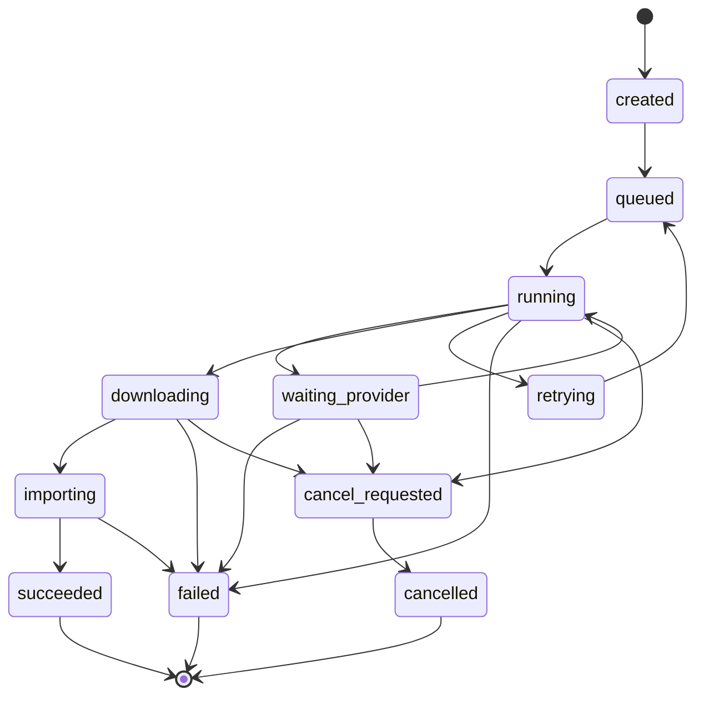
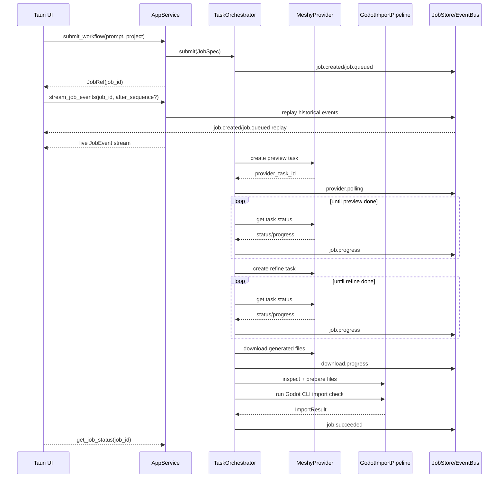

# godot-bridle 概要设计

> **文档版本**：v0.2
> **创建日期**：2026-06-18
> **阶段**：概要设计
> **依赖文档**：
> - [02-requirements-analysis.md](02-requirements-analysis.md) v0.2
> - [03-provider-research-and-tech-stack.md](03-provider-research-and-tech-stack.md) v0.1
> - [04-architecture-decisions.md](04-architecture-decisions.md) v0.1
> **状态**：待评审

---

## 1. 设计目标

Bridle MVP 的概要设计目标是完成一条稳定闭环：

> 桌面应用选择 Godot 项目 → 配置 BYOK → 提交角色生成 job → Meshy 生成并下载 GLB → Bridle 检测和导入 → Godot 项目出现可用资产和示例资源。

设计必须满足：

- 桌面优先，不走 WebUI 主路线；
- 所有长任务后台执行，不阻塞 Tauri UI；
- LLM Provider 复用 LiteLLM，测试阶段默认 DeepSeek；
- 资产 Provider 自研抽象，MVP 默认 Meshy；
- Provider 通过 capability 匹配，不让工作流绑定供应商；
- BYOK、安全脱敏、连接测试从 MVP 开始具备；
- Godot 集成 MVP 走 FS + Godot CLI，MCP 后置。

---

## 2. 系统分层

```
Desktop Layer
  Tauri v2 + TypeScript
  - project picker
  - BYOK settings
  - workflow launcher
  - job progress/log/result views

Application Service Layer
  bridle.app
  - desktop-facing API
  - submit/query/cancel jobs
  - provider connection tests
  - project metadata summary

Domain Harness Layer
  bridle.domain + bridle.harness
  - Pydantic domain models
  - async task orchestrator
  - workflow state machine
  - event bus
  - job store
  - cache
  - benchmark recorder
  - error taxonomy

Provider Layer
  bridle.providers
  - LLMProviderFacade -> LiteLLM SDK
  - AssetProviderFacade -> Meshy MVP
  - capability registry

Godot Integration Layer
  bridle.godot
  - project detector
  - metadata collector
  - import pipeline
  - Godot CLI bridge
```

---

## 3. 进程与通信边界

### 3.1 MVP 进程模型

```
┌──────────────────────┐
│ Tauri Desktop Process │
│ UI + Tauri Commands   │
└───────────┬──────────┘
            │ command/event bridge
┌───────────▼──────────┐
│ Python Sidecar        │
│ Bridle Core           │
│ asyncio event loop    │
│ bounded job queue     │
│ worker pool           │
└───────────┬──────────┘
            │
┌───────────▼──────────┐
│ External Processes    │
│ Godot CLI/headless    │
└──────────────────────┘
```

### 3.2 通信协议

MVP 采用 **stdio JSON-RPC over JSON Lines** 作为 Tauri 与 Python sidecar 的主通信协议。

选择理由：

- Tauri sidecar 模型天然适合 stdio 通信；
- 不需要启动本地 HTTP/WebSocket server，避免端口冲突、防火墙提示和本机服务暴露面；
- JSON-RPC 能表达 request/response/error，JSON Lines 能承载事件 notification；
- 长任务只返回 `job_id`，事件通过 notification 推送，符合非阻塞要求。

备选方案：

- localhost WebSocket/HTTP 仅作为备选事件通道；
- 若启用 localhost，必须绑定 `127.0.0.1`，使用随机端口和一次性 token；
- 不允许把 WebUI 或远程 HTTP API 作为 MVP 产品形态。

协议约束：

- 每条消息为一行 UTF-8 JSON；
- request 使用 JSON-RPC 2.0 风格：`jsonrpc`、`id`、`method`、`params`；
- response 必须包含同一 `id`；
- job 事件通过 notification 推送：无 `id`，`method = "job.event"`；
- 所有消息必须带 `protocol_version`；
- sidecar 启动后先发送 `sidecar.ready`；
- Tauri command 只能做短生命周期操作；
- 桌面提交长任务时调用 `submit_job()`，立即拿到 `job_id`；
- Python sidecar 内部负责 Provider 请求、轮询、下载、Godot CLI 和文件写入；
- CLI 与桌面复用同一 `bridle.app.services`，不能另写业务路径。

---

## 4. 核心模块设计

### 4.1 `bridle.app`

职责：

- 向桌面层暴露稳定 API；
- 封装异步任务提交、查询、取消；
- 提供项目打开、Provider 配置、连接测试；
- 聚合 domain/harness/provider/godot 层，不把底层细节泄露给 UI。

核心接口草案：

```python
class BridleAppService:
    async def open_project(self, path: Path) -> ProjectSummary: ...
    async def list_providers(self) -> list[ProviderSummary]: ...
    async def test_provider(self, provider_id: str) -> ProviderHealth: ...
    async def submit_workflow(self, request: WorkflowRequest) -> JobRef: ...
    async def get_job_status(self, job_id: str) -> JobStatus: ...
    async def cancel_job(self, job_id: str) -> CancelResult: ...
    async def stream_job_events(self, job_id: str) -> AsyncIterator[JobEvent]: ...
```

### 4.2 `bridle.domain`

职责：

- 定义 Pydantic v2 领域模型；
- 作为 UI、Provider、Workflow、Godot 管线之间的稳定契约。

关键模型：

- `ProjectRef`
- `ProjectSummary`
- `ProviderId`
- `ProviderCapability`
- `ProviderHealth`
- `WorkflowRequest`
- `JobRef`
- `JobStatus`
- `JobEvent`
- `AssetGenerationRequest`
- `AssetJob`
- `GeneratedAsset`
- `ImportResult`
- `BridleError`

### 4.3 `bridle.harness.task_orchestrator`

职责：

- 管理后台 job 生命周期；
- 控制并发；
- 执行取消、重试、超时；
- 把阶段状态写入 SQLite；
- 把事件推送给 event bus。

MVP 实现：

- `asyncio.Queue(maxsize=max(4, os.cpu_count() or 1))`；
- 固定 worker pool；
- 每个 job 包含 workflow name、payload、project、stage、attempt；
- I/O 任务用 async；
- 阻塞任务用 `asyncio.to_thread()`；
- Godot CLI 用 async subprocess。

核心接口草案：

```python
class TaskOrchestrator:
    async def submit(self, job: JobSpec) -> JobRef: ...
    async def status(self, job_id: str) -> JobStatus: ...
    async def cancel(self, job_id: str) -> CancelResult: ...
    async def events(self, job_id: str) -> AsyncIterator[JobEvent]: ...
```

### 4.4 `bridle.harness.workflow`

职责：

- 把模板定义转换为可执行阶段；
- 每个阶段可重试、可取消、可记录；
- 工作流只依赖 capability，不依赖供应商类。

MVP 角色生成工作流阶段：

1. `validate_project`
2. `resolve_providers`
3. `submit_text_to_3d_preview`
4. `poll_preview`
5. `submit_refine`
6. `poll_refine`
7. `download_assets`
8. `inspect_glb`
9. `prepare_godot_files`
10. `run_godot_import_check`
11. `generate_sample_scene_or_script`
12. `finalize_asset_record`

阶段 7-12 的 I/O 契约：

| 阶段 | 输入 | 输出 | 落盘位置 |
|---|---|---|---|
| `download_assets` | Provider 完成任务响应、文件 URL、`asset_id`、项目输出目录 | `DownloadedAssetBundle`：GLB、本地纹理路径、原始 provider metadata | `res://bridle/generated/<asset_id>/source/` |
| `inspect_glb` | `DownloadedAssetBundle.model_glb_path` | `GlbInspectionReport`：可解析性、尺寸、材质槽、贴图引用、warnings | `res://bridle/generated/<asset_id>/bridle_asset.json` |
| `prepare_godot_files` | `DownloadedAssetBundle`、`GlbInspectionReport`、项目配置 | `PreparedGodotAsset`：规范化目录、材质资源计划、示例资源计划 | `res://bridle/generated/<asset_id>/godot/` |
| `run_godot_import_check` | `PreparedGodotAsset`、Godot executable、项目路径 | `ImportResult`：exit code、stdout/stderr 摘要、导入产物检查结果 | SQLite `job_events` + `bridle_asset.json` |
| `generate_sample_scene_or_script` | `PreparedGodotAsset`、`ImportResult` | `SampleResourceResult`：`preview_scene.tscn`、`use_asset.gd` | `res://bridle/generated/<asset_id>/godot/` |
| `finalize_asset_record` | 所有前序结果 | `GeneratedAssetRecord`：资产索引、状态、文件清单、provider metadata 摘要 | SQLite `generated_assets` + `bridle_asset.json` |

### 4.5 `bridle.harness.event_bus`

职责：

- 为桌面 UI、CLI、日志和测试提供统一事件流；
- 保证长任务进度可见；
- 允许失败时定位阶段。

事件最小字段：

```python
JsonValue = str | int | float | bool | None | list["JsonValue"] | dict[str, "JsonValue"]

class JobEvent(BaseModel):
    id: str
    job_id: str
    type: str
    stage: str | None
    message: str
    progress: float | None
    payload: dict[str, JsonValue] = {}
    created_at: datetime
```

事件重放机制：

- `JobEvent` 必须先写入 SQLite `job_events`，再推送到内存 event bus；
- `stream_job_events(job_id)` 建立订阅时，先按 `created_at, sequence` 从 SQLite 回放历史事件；
- 回放完成后再切换到实时事件流；
- 客户端可传入 `after_event_id` 或 `after_sequence`，用于断线续订；
- 如果实时事件推送失败，不影响 job 执行，UI 可通过再次订阅重放补齐；
- 这条规则用于避免 UI 晚于 `job.created` / `job.queued` 订阅导致早期事件丢失。

### 4.6 `bridle.harness.job_store`

职责：

- SQLite 持久化 job；
- 支持应用重启后查看历史；
- 为未来恢复任务保留阶段边界。

MVP 表：

- `projects`
- `provider_configs`
- `jobs`
- `job_events`
- `generated_assets`
- `benchmark_samples`

### 4.7 `bridle.providers.llm_litellm`

职责：

- 包装 LiteLLM SDK；
- 默认接入 DeepSeek；
- 转换 LiteLLM streaming chunk 为 Bridle `JobEvent` 或 `LLMEvent`；
- 保留 DeepSeek reasoner metadata；
- 映射错误类型。

约束：

- 业务层不直接 import LiteLLM；
- 所有 Key 从 `KeyResolver` 获取；
- 支持外部 Gateway URL 预留。

### 4.8 `bridle.providers.asset_meshy`

职责：

- 实现 Meshy Text-to-3D preview/refine；
- 轮询任务状态；
- 下载 GLB/纹理；
- 将 Meshy 原始响应转换为 `GeneratedAsset`。

约束：

- 不直接写 Godot 项目结构；
- 不阻塞调用方；
- 只通过 worker/orchestrator 执行；
- 所有 API 调用有 timeout/retry/cancellation check。

### 4.9 `bridle.godot`

职责：

- 识别 Godot 项目；
- 采集项目元数据；
- 管理生成资产输出目录；
- 检测 GLB；
- 生成 Godot 资源文件或示例脚本；
- 调用 Godot CLI 做导入校验。

MVP 目录约定：

```text
res://bridle/generated/<asset_id>/
  source/
    model.glb
    textures/
  godot/
    materials/
    preview_scene.tscn
    use_asset.gd
  bridle_asset.json
```

---

## 5. 异步 job 生命周期



阶段规则：

- `created`：job 已创建但尚未入队；
- `queued`：等待 worker；
- `running`：本地步骤执行中；
- `waiting_provider`：外部 Provider 异步任务轮询中；
- `downloading`：下载资产；
- `importing`：GLB 检测或 Godot CLI 导入；
- `retrying`：可恢复错误等待重试；
- `failed`：不可恢复错误；
- `cancel_requested`：等待阶段边界取消；
- `cancelled`：已取消并落库。

---

## 6. 角色生成时序



---

## 7. 错误模型

统一错误类型：

- `ConfigError`
- `AuthError`
- `ProviderCapabilityError`
- `ProviderRateLimitError`
- `ProviderTaskFailedError`
- `NetworkError`
- `DownloadError`
- `AssetValidationError`
- `GodotProjectError`
- `GodotCliError`
- `CancelledError`
- `InternalError`

错误必须包含：

- `code`
- `message`
- `stage`
- `provider_id`
- `retryable`
- `safe_details: str`

严禁包含：

- 完整 API Key；
- Authorization header；
- 带签名 URL；
- 用户本地敏感路径的非必要片段。

---

## 8. BYOK 设计

### 8.1 MVP 配置来源

优先级：

1. 运行时显式传入配置；
2. 项目级 `bridle.toml`；
3. 用户级配置；
4. 环境变量；
5. Provider 默认值。

MVP 可以先只实现环境变量 + TOML 元数据，但接口按优先级设计。

密钥安全规则：

- TOML 中只允许写 `api_key_env = "ENV_VAR_NAME"` 这类环境变量引用；
- TOML 禁止直接写入 `api_key`、`secret`、`token` 等明文字段；
- 配置加载器发现疑似明文 Key 时必须拒绝加载或标记为安全错误；
- 多来源配置指向同一 Provider Key 时，不静默覆盖，必须产生 warning，并在 UI 中展示“当前使用来源”；
- 项目级配置不得存储密钥值，只能引用环境变量名或未来的 keyring alias。

### 8.2 配置示例

```toml
[providers.llm.deepseek]
type = "llm"
backend = "litellm"
model = "deepseek/deepseek-chat"
api_key_env = "DEEPSEEK_API_KEY"
default_for = ["llm.chat", "llm.stream"]

[providers.asset.meshy]
type = "asset"
capabilities = ["model3d.text_to_3d", "texture.retexture", "rigging.auto_rig"]
api_key_env = "MESHY_API_KEY"
default_for = ["model3d.text_to_3d"]

[godot]
executable = "godot"
generated_assets_dir = "res://bridle/generated"
```

### 8.3 连接测试

每个 Provider 必须实现或声明连接测试策略：

- LLM：轻量 model list 或最小 chat request；
- Meshy：账户/API endpoint ping 或最小权限检查；
- Godot CLI：`godot --version`；
- 项目：检测 `project.godot`。

---

## 9. Provider 能力模型与 Resolver

`ProviderCapability` 的 canonical source 是 [04-architecture-decisions.md](04-architecture-decisions.md) 中的 ADR-005。概要设计只引用该枚举，不重复定义第二份能力列表，避免后续漂移。

工作流请求只声明需要能力：

```python
required_capabilities = [
    ProviderCapability.MODEL3D_TEXT_TO_3D,
]
```

Provider resolver 负责选择默认 Provider 或用户指定 Provider。

Resolver 规则：

| 场景 | 规则 |
|---|---|
| 用户显式指定 Provider | 若 Provider 存在且满足全部 required capabilities，直接使用 |
| 显式 Provider 不满足能力 | 抛出 `ProviderCapabilityError`，不自动换供应商 |
| 未显式指定 Provider | 按 required capabilities 查找候选 |
| 候选包含 `default_for` 匹配项 | 优先选择 `default_for` 覆盖 required capabilities 的 Provider |
| 多个候选均匹配 | 选择配置文件中最先声明的 Provider |
| 能力组合需要多个 Provider | Resolver 返回 Provider plan，例如 LLM 用 DeepSeek、3D 用 Meshy |
| 无候选满足能力 | 抛出 `ProviderCapabilityError`，错误中列出缺失 capability |
| Provider 未配置 Key | 抛出 `AuthError` 或 `ConfigError`，不降级到其他 Provider，除非用户启用 fallback |

Provider plan 示例：

```python
class ProviderPlan(BaseModel):
    llm_provider_id: str | None = None
    model3d_provider_id: str | None = None
    texture_provider_id: str | None = None
    rigging_provider_id: str | None = None
    animation_provider_id: str | None = None
```

---

## 10. 桌面 UI MVP

MVP 最小页面：

1. **Project**
   - 选择 Godot 项目；
   - 显示 Godot 版本、插件、目录摘要；
   - 显示生成资产目录。

2. **Providers**
   - DeepSeek Key 状态；
   - Meshy Key 状态；
   - 连接测试；
   - 脱敏显示。

3. **Generate**
   - 角色描述输入；
   - 模型风格/low-poly 选项；
   - 目标目录；
   - 启动任务。

4. **Jobs**
   - 当前 job 进度；
   - 阶段日志；
   - 取消按钮；
   - 成功后的资产路径和打开提示。

约束：

- UI 不直接调用 Provider；
- UI 不直接执行 Godot CLI；
- UI 不等待长任务；
- UI 所有长任务状态来自 `JobEvent`。

---

## 11. 测试设计

### 11.1 单元测试

- Pydantic domain model 校验；
- capability resolver；
- KeyResolver 脱敏；
- error mapping；
- job state transition；
- output path normalization。

### 11.2 集成测试

- LiteLLM DeepSeek mock/录制；
- Meshy mock/录制；
- Godot 项目 fixture；
- Godot CLI 可选测试；
- GLB fixture 检测。

### 11.3 桌面响应性测试

- 提交模拟 60 秒 job；
- UI 必须可继续响应；
- 进度事件持续刷新；
- 取消能进入 `cancel_requested` / `cancelled`；
- Tauri command 不超过短时阈值。

### 11.4 性能基线

- LLM 首 token；
- Provider 轮询间隔；
- 下载吞吐；
- GLB 检测耗时；
- Godot CLI 导入耗时；
- job event 延迟。

---

## 12. MVP 交付切片

建议按以下纵向切片实现：

### Slice 1：桌面壳 + Python sidecar ping

- Tauri 主窗口；
- Python sidecar 启动；
- `get_version()` / `health()`；
- 事件通道打通。

### Slice 2：项目选择 + 元数据

- 选择 Godot 项目；
- 检测 `project.godot`；
- 显示项目摘要；
- 保存最近项目。

### Slice 3：BYOK + DeepSeek 连接测试

- 环境变量读取；
- Key 脱敏；
- LiteLLM facade；
- DeepSeek 连接测试。

### Slice 4：异步 job 引擎

- `submit_job`；
- `stream_job_events`；
- `cancel_job`；
- SQLite job store；
- 模拟长任务验证 UI 不冻结。

### Slice 5：Meshy Provider

- Text-to-3D preview；
- refine；
- 轮询；
- 下载；
- 事件进度。

### Slice 6：Godot 导入管线

- 输出目录；
- GLB 检测；
- 贴图整理；
- Godot CLI import check；
- 示例脚本/场景。

### Slice 7：角色生成闭环

- 模板参数；
- Provider resolution；
- 完整 job；
- 结果面板；
- 错误和取消路径。

---

## 13. 待设计细化

下一阶段需要进入详细设计：

1. `JobEvent` / `JobStatus` / `JobSpec` Pydantic schema；
2. SQLite schema；
3. stdio JSON-RPC 消息 schema；
4. Meshy API adapter 详细状态映射；
5. Godot 生成目录和 `.tscn/.tres` 写入规范；
6. 桌面 UI 信息架构和页面原型；
7. Provider 插件加载机制。

---

## 14. 日志与可观测性设计

### 14.1 日志目标

日志用于三类场景：

- 用户在桌面端查看当前任务进度和失败原因；
- 开发者调试 Provider、下载、导入、Godot CLI 问题；
- 后续 OpenTelemetry tracing 和性能基线分析。

### 14.2 日志级别

| 级别 | 使用场景 | 是否显示在桌面默认日志 |
|---|---|---|
| `debug` | Provider 原始状态、轮询细节、内部状态转换 | 默认隐藏 |
| `info` | job 阶段开始/完成、连接测试、下载进度 | 默认显示 |
| `warning` | 可恢复问题、配置来源冲突、非致命导入 warning | 默认显示 |
| `error` | job 失败、Provider 失败、Godot CLI 失败 | 默认显示 |
| `critical` | sidecar 不可恢复错误、数据损坏 | 默认显示并提示导出诊断 |

### 14.3 结构化日志字段

日志事件与 `JobEvent` 对齐，至少包含：

- `timestamp`
- `level`
- `event_type`
- `job_id`
- `stage`
- `provider_id`
- `message`
- `safe_details`
- `duration_ms`
- `error_code`

### 14.4 脱敏策略

日志系统必须复用错误模型的脱敏规则：

- 不记录完整 API Key；
- 不记录 Authorization header；
- 不记录带签名 URL；
- 本地路径只在必要时记录，桌面展示可折叠；
- Provider 原始响应进入 debug 日志前必须经过 sanitizer。

### 14.5 桌面日志查看

桌面端 Jobs 页面显示：

- 当前 job 阶段；
- 最近事件；
- 可折叠详细日志；
- 失败时的安全错误摘要；
- “导出诊断包”入口，诊断包默认不包含密钥。

---

## 15. 安全设计

### 15.1 Sidecar 通信安全

MVP 使用 stdio JSON-RPC，因此默认信道只存在于 Tauri 启动的子进程 stdin/stdout 之间，不开放网络端口。

约束：

- sidecar 不监听公网或局域网端口；
- 若启用 localhost 备选通道，必须绑定 `127.0.0.1`；
- localhost 通道必须使用随机端口和一次性 token；
- sidecar 应校验 `protocol_version`，拒绝未知协议版本。

### 15.2 持久化敏感字段

SQLite 和 TOML 中字段按敏感级别分类：

| 类型 | 示例 | MVP 处理 |
|---|---|---|
| Secret | API Key、token、client secret | 禁止持久化明文 |
| Sensitive | 本地项目路径、Provider account id | 可持久化，但日志脱敏或折叠展示 |
| Public | provider id、capability、模型名 | 可持久化 |

P1 引入系统钥匙串后，SQLite/TOML 只保存 key alias，不保存 secret value。

### 15.3 资产文件来源校验

下载资产必须记录：

- provider id；
- 原始 URL 的脱敏摘要；
- content length；
- content type；
- sha256；
- 下载时间；
- 本地路径。

MVP 校验：

- 下载大小超过配置上限时失败；
- content type 或扩展名与期望格式严重不符时 warning 或失败；
- GLB 必须可解析，否则进入 `AssetValidationError`；
- zip/压缩包解压必须防止 path traversal；
- 生成文件只能写入项目内约定目录。

### 15.4 Godot 项目写入安全

- 所有生成资产默认写入 `res://bridle/generated/<asset_id>/`；
- 不覆盖用户已有文件，除非文件由同一 `asset_id` 生成且 job 明确处于恢复模式；
- 输出路径必须规范化并验证位于 Godot 项目根目录内；
- 失败时保留中间产物和日志，但标记状态，避免 Godot 误认为完整资产。
