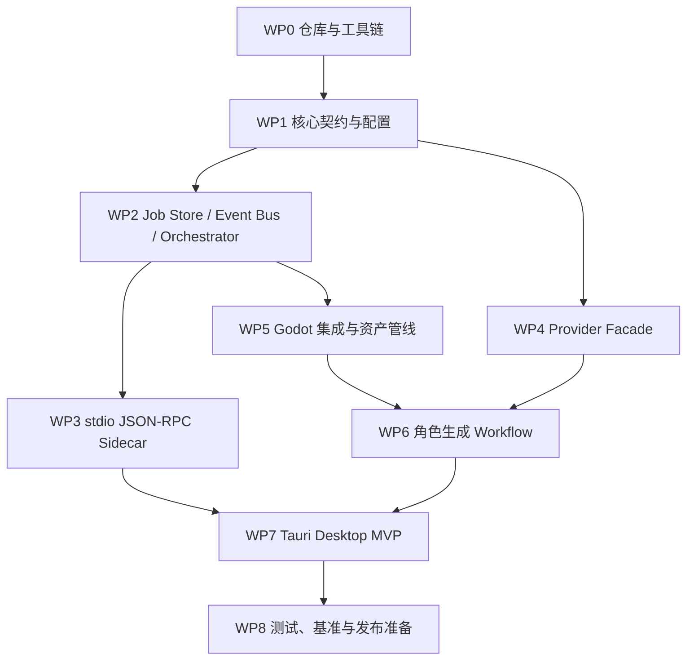

# godot-bridle v0.1-alpha 实施计划

> **文档版本**：v0.1
> **创建日期**：2026-06-18
> **阶段**：实施计划
> **依赖文档**：
> - [02-requirements-analysis.md](02-requirements-analysis.md) v0.2
> - [04-architecture-decisions.md](04-architecture-decisions.md) v0.1
> - [05-system-design.md](05-system-design.md) v0.2
> - [06-detailed-design-core-contracts.md](06-detailed-design-core-contracts.md) v0.1
> **状态**：待评审

---

## 1. Alpha 目标

v0.1-alpha 只证明一条完整、可诊断、不中断 UI 的核心链路：

> 桌面应用选择 Godot 项目 → 配置 DeepSeek 和 Meshy BYOK → 提交角色生成任务 → 后台执行 Meshy 生成、下载、GLB 检测和 Godot CLI 导入 → 桌面端实时查看事件 → Godot 项目中出现可用生成资产。

本阶段不追求完整游戏生成、不追求覆盖所有资产供应商、不做 WebUI、不做复杂语义缓存、不做企业协作。向量数据库/RAG 知识库作为 P1 增强，详见 [08-rag-vector-knowledge-base.md](08-rag-vector-knowledge-base.md)。

---

## 2. 交付边界

### 2.1 必须交付

| 编号 | 交付项 | 验收标准 |
|---|---|---|
| A1 | Python core 项目骨架 | `uv` 可创建环境，核心包、测试目录和基础命令可运行 |
| A2 | Domain schema | 关键 Pydantic 模型与 ADR-005 capability 一致 |
| A3 | SQLite job store | 可创建 job、写入事件、按 sequence 回放事件 |
| A4 | Async Task Orchestrator | 长任务后台执行，支持状态、事件、取消标记、失败记录 |
| A5 | stdio JSON-RPC sidecar | Tauri 可发起短命令，长任务只返回 `job_id` |
| A6 | BYOK 配置与脱敏 | TOML 禁止明文 key，仅允许 `api_key_env`；日志不泄露密钥 |
| A7 | LiteLLM + DeepSeek | 可做连接测试和一次最小 chat 调用 |
| A8 | Meshy Provider MVP | 可提交 Text-to-3D、轮询、下载 GLB 或 mock 同等流程 |
| A9 | Godot 项目检测与导入 | 能识别 `project.godot`，把资产落到 `res://bridle/generated/<asset_id>/` |
| A10 | Tauri 桌面 MVP | 项目选择、Provider 设置、任务提交、进度/日志/结果视图可用 |
| A11 | 测试与基准日志 | DeepSeek 测试配置、orchestrator 测试、事件回放测试、UI 不冻结验证 |

### 2.2 明确不做

- 不内置 Bifrost/Portkey gateway，只预留配置和性能基准对照；
- 不做本地 WebUI；
- 不做多用户权限模型；
- 不承诺自动修复所有 GLB；
- 不把 Godot MCP 作为 alpha 必需项；
- 不做 Provider marketplace，只做配置驱动注册。

---

## 3. 工作包拆解

### WP0：仓库与工具链初始化

| 任务 | 产出 | 依赖 |
|---|---|---|
| 创建 `pyproject.toml` | Python 3.11+、ruff、pytest、pydantic、httpx、structlog、litellm | 无 |
| 创建包目录 | `bridle/` 与 `tests/` 基础结构 | 无 |
| 选择 SQLite 访问层 | alpha 可用 `sqlite3`，保留迁移脚本目录 | 无 |
| 创建 Tauri 桌面目录 | `desktop/`、TypeScript、Tauri v2 基础项目 | 无 |

验收：

- `uv run pytest` 至少可运行空测试；
- `uv run python -m bridle.app.cli health` 返回核心版本信息；
- Tauri dev 可启动空壳桌面窗口。

### WP1：核心契约与配置

| 任务 | 产出 | 依赖 |
|---|---|---|
| 实现 domain schema | `bridle/domain/*.py` | WP0 |
| 实现 capability registry | ADR-005 capability 枚举和测试 | WP0 |
| 实现配置加载 | TOML + env resolver + Pydantic validation | WP0 |
| 实现 secret sanitizer | 日志、错误、事件 payload 脱敏 | WP0 |

验收：

- TOML 中出现 `api_key`、`secret`、`token`、`authorization` 明文字段会失败；
- 多来源声明同一个 env key 时产生 warning；
- capability 枚举与 ADR-005 列表测试一致。

### WP2：Job Store、Event Bus、Orchestrator

| 任务 | 产出 | 依赖 |
|---|---|---|
| SQLite schema | `jobs`、`job_events`、`generated_assets` | WP1 |
| Event append/replay | 先写 SQLite，再推送 live event | WP1 |
| Orchestrator queue | `asyncio.Queue(maxsize=max(4, os.cpu_count() or 1))` | WP1 |
| Worker pool | 后台执行 async stage，阻塞任务用 `asyncio.to_thread()` | WP1 |
| Cancel/retry 基础策略 | cancel flag、retrying event、失败分类 | WP1 |

验收：

- 订阅晚于 `job.created` 也能回放历史事件；
- 模拟 3 分钟任务时 UI/API command 不阻塞；
- 取消任务后状态进入 `cancel_requested` 或 `cancelled`；
- 失败任务持久化 `error_code` 和脱敏 `safe_details`。

### WP3：stdio JSON-RPC Sidecar

| 任务 | 产出 | 依赖 |
|---|---|---|
| JSON Lines reader/writer | request/response/notification 编解码 | WP2 |
| 方法路由 | `health`、`open_project`、`list_providers`、`test_provider`、`submit_workflow`、`get_job_status`、`cancel_job`、`stream_job_events` | WP2 |
| 事件 notification | `job.event` 推送与 sequence 去重字段 | WP2 |
| 协议错误处理 | JSON-RPC error code + Bridle error code | WP2 |

验收：

- sidecar 启动发送 `sidecar.ready`；
- 非法 JSON 不导致进程崩溃；
- 长任务调用立即返回 `job_id`；
- `stream_job_events` 支持 `after_sequence` 回放。

### WP4：Provider Facade

| 任务 | 产出 | 依赖 |
|---|---|---|
| Provider resolver | 显式 provider、default_for、声明顺序、能力组合规则 | WP1 |
| LiteLLM adapter | DeepSeek model 配置、连接测试、最小 chat | WP1 |
| Meshy adapter | submit、poll、download、错误映射 | WP2 |
| Provider health | auth、quota/rate-limit、latency、safe details | WP1 |

验收：

- DeepSeek API key 从环境变量读取；
- Provider 不满足 capability 时抛 `ProviderCapabilityError`；
- Meshy 长轮询不会阻塞 sidecar；
- Provider 错误映射为统一错误码。

### WP5：Godot 集成与资产管线

| 任务 | 产出 | 依赖 |
|---|---|---|
| Project detector | 识别 `project.godot`、项目名、基础文件统计 | WP1 |
| Asset downloader | `.part` 原子下载、sha256、content-type/size 校验 | WP2 |
| GLB inspection | `trimesh` / `pygltflib` 基础检测报告 | WP2 |
| Import preparation | `source/`、`godot/`、`logs/`、`bridle_asset.json` | WP2 |
| Godot CLI bridge | `asyncio.create_subprocess_exec` 调用 headless/import | WP2 |

验收：

- 任何 Provider 文件名都不会直接作为落盘路径；
- 资产只写入 `res://bridle/generated/<asset_id>/`；
- Godot CLI 阻塞数秒时桌面 UI 仍可响应；
- 导入日志可在桌面端打开或导出。

### WP6：角色生成 Workflow

| 任务 | 产出 | 依赖 |
|---|---|---|
| Workflow request schema | `character_gen` 请求与参数校验 | WP1 |
| Stage runner | 12 个阶段按 `05-system-design.md` 顺序执行 | WP2, WP4, WP5 |
| Provider plan | LLM + model3d capability 组合解析 | WP4 |
| Result record | `GeneratedAssetRecord` 持久化 | WP5 |

验收：

- 成功路径产生 `job.succeeded` 和资产记录；
- 任一阶段失败时停止后续阶段，并保留可诊断事件；
- 重试不会重复覆盖不同 `asset_id` 的产物；
- mock provider 测试能覆盖全流程。

### WP7：Tauri Desktop MVP

| 任务 | 产出 | 依赖 |
|---|---|---|
| Sidecar manager | 启动 Python sidecar、读取 stdout JSON Lines | WP3 |
| Project screen | 选择 Godot 项目、展示摘要和警告 | WP5 |
| Provider settings | DeepSeek/Meshy env var 配置、连接测试、脱敏显示 | WP4 |
| Workflow screen | 输入角色描述、选择 provider、提交 job | WP6 |
| Job monitor | 状态、阶段进度、事件日志、取消按钮、结果路径 | WP3, WP6 |

验收：

- 桌面端没有 WebUI route；
- 任务执行期间窗口可拖动、按钮响应、日志持续刷新；
- 连接测试失败显示脱敏错误；
- 成功后用户能看到 Godot `res://` 路径和本地诊断日志。

### WP8：测试、基准与发布准备

| 任务 | 产出 | 依赖 |
|---|---|---|
| Unit tests | schema、resolver、key resolver、event replay | WP1-WP4 |
| Integration tests | mock Meshy、mock Godot CLI、sidecar protocol | WP2-WP6 |
| DeepSeek smoke tests | 使用真实 DeepSeek API 的可选测试标记 | WP4 |
| UI responsiveness test | 模拟长任务，验证 command 不阻塞 | WP7 |
| Benchmark recorder | 记录 provider latency、stage duration、成功率 | WP2-WP6 |
| Packaging notes | Windows alpha 运行说明和 sidecar 打包注意事项 | WP7 |

验收：

- 默认测试不需要真实 API key；
- 设置 `DEEPSEEK_API_KEY` 后可运行 DeepSeek smoke test；
- 真实 API 测试不会输出密钥或完整敏感 headers；
- Alpha 包能在开发机启动并完成 mock 全流程。

---

## 4. 推荐实施顺序

原则：

- 先做 mock provider 和 mock Godot CLI，再接真实 Meshy/Godot；
- 先让事件链路、取消、失败和回放可靠，再追求 UI 细节；
- 所有长任务都先以 job 形式接入，不给 Tauri command 留同步阻塞口子；
- 真实 API 测试必须是 opt-in。

---

## 5. 风险与缓解

| 风险 | 表现 | 缓解 |
|---|---|---|
| Tauri sidecar 协议复杂度上升 | stdout 同时承载日志和协议消息导致解析失败 | sidecar stdout 只输出 JSON Lines 协议，日志写 stderr 和文件 |
| Meshy 状态字段变化 | polling 状态映射错误 | adapter 层保留 raw payload，未知状态进入 `waiting_provider` 并发 warning |
| Godot CLI 路径差异 | 用户机器找不到 Godot | 支持手动配置 Godot executable path，连接测试提前失败 |
| GLB 质量不稳定 | 导入后材质/动画异常 | alpha 只承诺检测和报告，不承诺全自动修复 |
| BYOK 配置门槛高 | 用户不知道 env var 是否生效 | Provider 设置页展示 masked key source 和连接测试结果 |
| 事件量过大 | UI 日志卡顿 | job event 分页/虚拟列表，SQLite event payload 控制大小 |

---

## 6. Alpha Exit Criteria

v0.1-alpha 完成条件：

1. 桌面应用可打开真实 Godot 项目。
2. 用户可以配置 DeepSeek 和 Meshy 的 `api_key_env`，并完成连接测试。
3. 用户提交角色生成 workflow 后，桌面端立即拿到 `job_id`，UI 不等待长任务。
4. Meshy 生成、下载、GLB 检测、Godot CLI 导入全部在后台 job 中执行。
5. `stream_job_events` 即使晚订阅，也能从 SQLite 回放 `job.created` 之后的完整历史事件。
6. 任务成功后，Godot 项目内存在 `res://bridle/generated/<asset_id>/bridle_asset.json`。
7. 任务失败时，桌面端展示统一错误码和脱敏 `safe_details`。
8. 默认测试全部通过；DeepSeek smoke test 在提供 key 时通过。
9. 日志、事件、诊断导出中没有明文 API key。

---

## 7. 下一步

实施开始前建议先评审以下三个点：

1. alpha 是否接受 Meshy 真实 API 之外提供 mock provider 作为默认开发路径；
2. Tauri UI 是否先做单窗口四页结构：Project、Providers、Generate、Jobs；
3. Windows alpha 是否作为第一打包平台，macOS/Linux 延后到下一轮。

---

## 8. P1 增强：RAG 与向量知识库

Alpha 完成后，建议优先实现本地 RAG 知识库，用于增强 Godot 项目理解、资产生成 Prompt 和导入失败诊断。

推荐交付切片：

| 编号 | 交付项 | 验收标准 |
|---|---|---|
| K1 | 知识模型与项目索引器 | 能扫描 Godot 项目、Bridle 文档和资产 manifest，生成带 hash 的 chunk |
| K2 | Chroma VectorStore | 本地持久化 collection，支持 upsert、delete、query 和 metadata filter |
| K3 | Embedding Provider | 复用 BYOK 和脱敏规则，默认测试可使用 mock embedding |
| K4 | RAG 问答服务 | `ask_project` 返回 answer、citations、检索结果和延迟 |
| K5 | 导入诊断集成 | Godot 导入失败后可检索相似错误和规则，生成诊断事件 |
| K6 | 桌面可视化 | Knowledge/Assistant 页面展示索引状态、引用片段、相似度和耗时 |

边界原则：

- SQLite 继续作为 job、event、provider config、generated asset 的事实源；
- 向量库只作为可重建语义索引；
- 默认使用 Chroma local persistent store，预留 Milvus/Elasticsearch 后端；
- RAG 回答必须展示引用来源，不能伪造项目事实。
