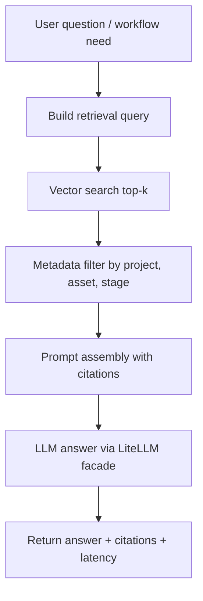

# godot-bridle RAG 与向量知识库设计

> **文档版本**：v0.1
> **创建日期**：2026-06-19
> **阶段**：P1 方案设计
> **依赖文档**：
> - [03-provider-research-and-tech-stack.md](03-provider-research-and-tech-stack.md) v0.1
> - [04-architecture-decisions.md](04-architecture-decisions.md) v0.1
> - [05-system-design.md](05-system-design.md) v0.2
> **状态**：建议采纳

---

## 1. 结论

Bridle 不应把 SQLite 全面替换为向量数据库。更合理的设计是：

> SQLite 继续负责 job、事件、配置元数据、资产记录等结构化持久化；向量数据库作为本地知识库，负责 Godot 项目、文档、日志和资产上下文的语义检索，并通过 RAG 增强 LLM 生成、导入诊断和项目问答。

这让向量数据库成为真实产品能力，而不是为了技术栈展示而硬接入。

---

## 2. 目标

P1 的 RAG/向量知识库目标是为 Bridle 增加三个能力：

1. **项目上下文增强生成**
   - 根据当前 Godot 项目的脚本、场景、目录结构、已有资产风格，为角色生成、示例脚本生成和导入资源命名提供上下文。

2. **资产导入诊断**
   - 根据 GLB 检测报告、Godot CLI 日志、Bridle job event、常见错误知识库，回答“为什么导入失败”和“下一步怎么修”。

3. **Godot/Bridle 知识助手**
   - 支持用户询问当前项目、生成资产、Bridle 工作流、Godot 导入规则，并返回带引用来源的回答。

---

## 3. 非目标

P1 不做：

- 不用向量数据库替代 SQLite job store；
- 不把所有文件无差别塞入向量库；
- 不做多用户企业知识库权限模型；
- 不做云端知识库服务；
- 不承诺 RAG 回答自动修改用户项目文件，修改仍应通过显式 workflow 或用户确认。

---

## 4. 技术选型

### 4.1 默认向量库

MVP/P1 默认选择 **Chroma local persistent store**。

理由：

- 桌面本地应用无需外部数据库服务；
- 持久化目录简单，便于随项目或用户数据目录管理；
- Python 集成成本低；
- 支持 metadata filter、collection、top-k 检索；
- 适合个人项目和简历展示中的本地 RAG 场景。

### 4.2 预留后端

Bridle 应设计 `VectorStore` 抽象，预留：

- Milvus：团队/大规模向量检索后端；
- Elasticsearch/OpenSearch：混合检索、BM25 + vector、日志检索；
- SQLite/FAISS fallback：轻量实验模式。

P1 不要求实现所有后端，只要求接口不绑定 Chroma。

### 4.3 Embedding Provider

Embedding 通过 Bridle Provider 体系接入，不直接散落在业务代码中。

可选策略：

- 默认：OpenAI-compatible embedding provider；
- 本地：sentence-transformers 或 Ollama embedding；
- 后续：通过 LiteLLM 或独立 embedding facade 统一管理。

Embedding key 必须复用 BYOK 和脱敏规则。

---

## 5. 数据来源

### 5.1 Godot 项目文件

可索引：

- `project.godot`
- `.gd`
- `.tscn`
- `.tres`
- `addons/` 中必要元数据
- `res://bridle/generated/**/bridle_asset.json`

默认跳过：

- `.godot/`
- `.import/`
- 大型二进制资产
- Provider 下载的原始大文件
- 临时文件、缓存目录

### 5.2 Bridle 内部数据

可索引：

- `GeneratedAssetRecord`
- `GlbInspectionReport`
- `ImportResult`
- 失败 job 的脱敏 `safe_details`
- 常见错误分类和解决建议
- docs 中的架构、工作流、Provider 说明

### 5.3 外部知识

P1 可引入：

- Godot 官方文档片段；
- Bridle 维护的 Godot 导入规则；
- GLB/glTF 常见问题；
- Meshy/Tripo 等 Provider 输出格式说明。

外部知识必须记录来源 URL、版本或抓取时间，避免用户误以为是项目本地事实。

---

## 6. 模块设计

建议新增包：

```text
bridle/
  knowledge/
    __init__.py
    documents.py
    chunking.py
    embeddings.py
    vector_store.py
    chroma_store.py
    indexer.py
    retriever.py
    rag.py
```

核心职责：

| 模块 | 职责 |
|---|---|
| `documents.py` | 统一 `KnowledgeDocument`、source、metadata、content hash |
| `chunking.py` | 文件类型感知切分，保留行号、节点路径、资源路径 |
| `embeddings.py` | embedding provider facade，复用 BYOK |
| `vector_store.py` | 向量库接口，不绑定 Chroma |
| `chroma_store.py` | Chroma 持久化实现 |
| `indexer.py` | 项目扫描、增量索引、删除失效 chunk |
| `retriever.py` | top-k、metadata filter、混合检索预留 |
| `rag.py` | prompt assembly、引用、回答生成 |

---

## 7. 核心模型草案

```python
class KnowledgeSourceType(str, Enum):
    GODOT_PROJECT = "godot_project"
    BRIDLE_DOC = "bridle_doc"
    BRIDLE_JOB = "bridle_job"
    ASSET_REPORT = "asset_report"
    EXTERNAL_DOC = "external_doc"


class KnowledgeDocument(BaseModel):
    source_id: str
    source_type: KnowledgeSourceType
    project_root: Path | None = None
    path: Path | None = None
    title: str | None = None
    content: str
    content_hash: str
    metadata: dict[str, JsonValue] = {}


class KnowledgeChunk(BaseModel):
    chunk_id: str
    source_id: str
    source_type: KnowledgeSourceType
    text: str
    content_hash: str
    start_line: int | None = None
    end_line: int | None = None
    metadata: dict[str, JsonValue] = {}


class RetrievalHit(BaseModel):
    chunk_id: str
    source_id: str
    source_type: KnowledgeSourceType
    text: str
    score: float
    citation: str
    metadata: dict[str, JsonValue] = {}


class RagAnswer(BaseModel):
    answer: str
    hits: list[RetrievalHit]
    model: str
    latency_ms: int
```

---

## 8. 索引策略

### 8.1 增量索引

索引器应以 `content_hash` 为幂等依据：

1. 扫描可索引文件；
2. 计算内容 hash；
3. hash 未变化则跳过；
4. hash 变化则删除旧 chunk，写入新 chunk；
5. 文件删除后移除对应 chunk；
6. 记录索引统计。

### 8.2 切分策略

建议：

- Markdown：按标题层级切分；
- GDScript：按 class/function 和相邻注释切分；
- `.tscn/.tres`：按 section 或资源节点切分；
- JSON manifest：按字段语义展开为文本；
- job log：按阶段和错误类型切分。

每个 chunk 必须保留可追踪 metadata，例如：

- `project_root`
- `res_path`
- `file_path`
- `start_line`
- `end_line`
- `asset_id`
- `job_id`
- `stage`
- `provider_id`

---

## 9. RAG 流程



回答必须：

- 明确引用来源；
- 区分“项目事实”和“模型推断”；
- 不伪造文件路径或 Godot API；
- 对高风险修改给出建议而不是自动执行。

---

## 10. 与工作流集成

### 10.1 角色生成 Prompt 增强

在 `character_gen` workflow 的早期阶段增加可选步骤：

1. 检索项目已有角色、材质、命名风格；
2. 检索目标目录约束和历史资产记录；
3. 将检索结果压缩为 prompt context；
4. 生成更贴近项目风格的 3D prompt 和 Godot 示例脚本。

### 10.2 导入错误诊断

当 `run_godot_import_check` 失败时：

1. 记录脱敏 stdout/stderr 摘要；
2. 检索相似错误、GLB 检测报告、Godot 导入规则；
3. 输出 `diagnosis` 事件，包含建议、引用、置信度；
4. 桌面 UI 在 Jobs 页面展示。

### 10.3 项目问答

新增应用服务：

```python
async def index_project_knowledge(project_root: Path) -> KnowledgeIndexSummary: ...
async def ask_project(project_root: Path, question: str) -> RagAnswer: ...
```

---

## 11. 桌面 UI

P1 新增 Knowledge/Assistant 能力：

1. **Knowledge 页面**
   - 索引状态；
   - 文档数量、chunk 数；
   - 最近索引时间；
   - 重新索引按钮；
   - 错误和跳过文件摘要。

2. **Assistant 面板**
   - 问答输入；
   - 回答；
   - 引用片段；
   - 来源文件/路径；
   - 相似度分数；
   - 检索耗时和生成耗时。

3. **Jobs 诊断面板**
   - 导入失败原因；
   - 相似历史错误；
   - 可执行建议；
   - 关联日志和资产 manifest。

---

## 12. SQLite 与向量库边界

| 数据 | SQLite | 向量库 |
|---|---|---|
| job 状态 | 是 | 否 |
| job event 顺序回放 | 是 | 否 |
| provider 配置元数据 | 是 | 否 |
| generated asset 主记录 | 是 | 可索引摘要 |
| GLB 检测报告 | 是或文件 | 可索引摘要 |
| Godot 脚本/场景语义 | 否 | 是 |
| 文档知识 | 否或文件 | 是 |
| 导入错误相似检索 | 可存原始事件 | 是 |

原则：

- SQLite 是事实源；
- 向量库是检索索引；
- 向量库可重建，不能成为唯一事实源；
- 删除项目或导出诊断包时必须能清理对应向量 collection。

---

## 13. 评估指标

P1 应记录：

- index duration；
- document count；
- chunk count；
- embedding latency；
- retrieval latency；
- answer latency；
- top-k hit rate；
- citation coverage；
- no-answer rate；
- 用户对诊断建议的采纳情况。

后续可补充小型评测集：

- Godot 导入错误问答；
- 项目结构问答；
- 资产生成 prompt 改写；
- GDScript 示例生成。

---

## 14. 简历表述建议

可写为：

> 基于 Python + LiteLLM + Chroma 为 Godot AI 资产生成工具设计并实现本地 RAG 知识库，支持 Godot 项目脚本、场景文件、生成资产元数据与导入日志的增量索引；通过 embedding 检索、metadata filter、top-k rerank 与引用溯源，为资产生成 Prompt 优化、导入错误诊断和 Godot 脚本辅助生成提供上下文增强能力。

增强版：

> 设计向量存储抽象层，默认使用 Chroma 本地持久化，预留 Milvus/Elasticsearch 后端；实现文档切分、去重、增量更新、检索评估与 RAG 响应可视化，在 Tauri 桌面端展示检索片段、相似度、引用来源和响应耗时。

---

## 15. 推荐实施切片

### Slice K1：知识模型与索引器

- 定义 `KnowledgeDocument` / `KnowledgeChunk`；
- 实现 Godot 项目扫描；
- 支持 Markdown、GDScript、TSCN 基础切分；
- 输出索引统计。

### Slice K2：Chroma VectorStore

- 接入 Chroma local persistent store；
- collection 按 project 隔离；
- 支持 upsert、delete、query；
- 支持 metadata filter。

### Slice K3：Embedding Provider

- 实现 embedding facade；
- 接入 BYOK；
- 增加 embedding 连接测试；
- 默认测试使用 mock embedding。

### Slice K4：RAG 问答

- 实现 `ask_project`；
- 生成带 citation 的回答；
- 默认测试不依赖真实 LLM。

### Slice K5：导入诊断集成

- 在 Godot 导入失败时触发检索；
- 生成诊断事件；
- 桌面 Jobs 页面展示建议和引用。

### Slice K6：桌面可视化

- Knowledge 页面；
- Assistant 面板；
- 检索结果、相似度和耗时展示。
